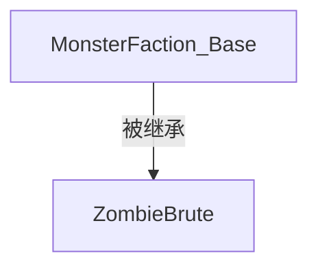
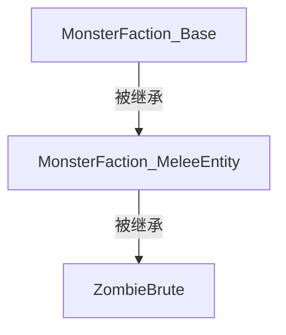
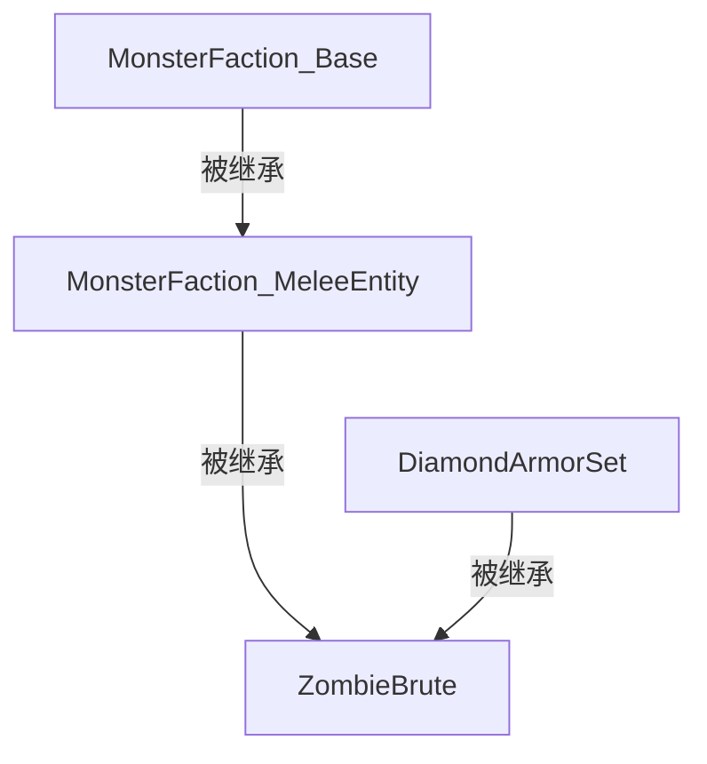

模板（Templates）是一项让生物"继承"一个或多个其他生物的特性的功能。

如果你已经熟悉面向对象编程，那么你会发现以下内容与"继承"的概念非常相似。

不过无论如何，模板一开始可能还是相当难理解。因此我们将从最基础开始，逐步深入讲解，直到更复杂的应用场景。

[[_TOC_]]

## 介绍
如前所述，模板允许生物继承另一个生物的特性。但这到底是什么意思呢？

为了用更简单的方式说明，我们以一个生物为例：
```yaml
ZombieBrute:
  Type: ZOMBIE
  Display: "&2僵尸暴徒 &7[Lv. <caster.level>]&r"
  Health: 30
  Damage: 5
  Faction: Monster
  Equipment:
  - Iron_Helmet HEAD
  - Iron_Chestplate CHEST
  - Iron_Leggings LEGS
  - Iron_Boots FEET
  - Shield OFFHAND
  Drops:
  - exp 10-15 1
  - rotten_flesh 1-2 1
  - ZombieBrute_Hearth 1 0.01
  Options:
    AlwaysShowName: true
    PreventOtherDrops: true
    PreventRandomEquipment: true
    PreventSunburn: true
    PreventItemPickup: true
    PreventJockeyMounts: true
    PreventTransformation: true
  AITargetSelectors:
  - clear
  - attacker
  - players
  AIGoalSelectors:
  - clear
  - meleeattack
  - randomstroll
  DamageModifiers:
  - PROJECTILE 1.15
  - ENTITY_ATTACK 0.75
  KillMessages:
  - '<target.name> 被 <caster.name> 打成了肉泥'
  - '尽管竭尽全力，<target.name> 还是没能战胜 <caster.name>'
  - '<target.name> 被 <caster.name> 杀死了'
  Skills:
  - skill{s=SelectRandomWeapon} @self ~onSpawn
  - skill{s=ZombieBrute_Bash} @target ~onTimer:60 0.4 ?targetwithin{d=10}
  - skill{s=CallZombies} @EIR ~onTimer:180 0.6
```
这个生物虽然做起来不复杂，但确实关联了不少元素，对吧？它有阵营、掉落物、一些选项……

现在，如果我们想创建另一个与它具有部分（甚至大部分！）相同特征的生物呢？通常我们需要将想要的内容从一个生物复制粘贴到另一个。虽然短期来看这能行，但如果以后想要*修改*这些特征呢？我们需要找到每个使用这些特征的生物，然后一个一个地改。这完全不可扩展！

但这时候，模板就派上用场了：还记得我们最初说的吗？模板允许跨生物继承特征。所以我们只需要创建一个拥有所有通用特征的生物，如果以后想要修改其中某些特征，不需要逐个生物去改，只需要修改那一个模板生物，改动就会自动应用到所有使用它作为模板的生物上！

接下来就是我们的第一个真正的模板使用示例。

## 单一模板
假设我们想让一组生物共享僵尸暴徒的阵营、选项、AI、部分技能和其他一些元素。首先，我们把这些元素放到一个生物里：
```yaml
MonsterFaction_Base:
  Type: ZOMBIE
  Faction: Monster
  Drops:
  - exp 10-15 1
  Options:
    AlwaysShowName: true
    PreventOtherDrops: true
    PreventRandomEquipment: true
    PreventSunburn: true
    PreventItemPickup: true
    PreventJockeyMounts: true
    PreventTransformation: true
  AITargetSelectors:
  - clear
  - attacker
  - players
  AIGoalSelectors:
  - clear
  - meleeattack
  - randomstroll
  DamageModifiers:
  - PROJECTILE 0.75
  - ENTITY_ATTACK 0.75
  KillMessages:
  - '<target.name> 被 <caster.name> 杀死了'
  Skills:
  - skill{s=SelectRandomWeapon} @self ~onSpawn
```

建好模板后，让（现在精简了的）僵尸暴徒继承它：
```yaml
ZombieBrute:
  Template: MonsterFaction_Base
  Display: "&2僵尸暴徒 &7[Lv. <caster.level>]&r"
  Health: 30
  Damage: 5
  Equipment:
  - Iron_Helmet HEAD
  - Iron_Chestplate CHEST
  - Iron_Leggings LEGS
  - Iron_Boots FEET
  - Shield OFFHAND
  Drops:
  - rotten_flesh 1-2 1
  - ZombieBrute_Hearth 1 0.01
  DamageModifiers:
  - PROJECTILE 1.15
  KillMessages:
  - '<target.name> 被 <caster.name> 打成了肉泥'
  - '尽管竭尽全力，<target.name> 还是没能战胜 <caster.name>'
  Skills:
  - skill{s=ZombieBrute_Bash} @target ~onTimer:60 0.4 ?targetwithin{d=10}
  - skill{s=CallZombies} @EIR ~onTimer:180 0.6
```
好了！只需要简单一行 `Template: MonsterFaction_Base`，`ZombieBrute` 就继承了 `MonsterFaction_Base` 中的所有元素。



但是，如果生物和它的模板都有某个相同元素会怎样呢？

### 共享元素
当生物和它的模板都包含某些相同元素时，会发生以下三种情况之一：
  * 模板的元素被生物中的同名元素覆盖。（**覆盖 Overridden**）
    * 例如：`MonsterFaction_Base` 和 `ZombieBrute` 都有 `PROJECTILE` 伤害修正，那么 `ZombieBrute` 中的会覆盖模板中的，最终生效的是生物自己的。
  * 模板的元素与生物的元素并存。（**部分覆盖 Partially Overridden**）
    * 例如：由于生物没有 `Faction` 元素，它将继承模板中的阵营，最终被视为 `Monsters` 阵营的成员。
    * 例如：`MonsterFaction_Base` 和 `ZombieBrute` 都有 DamageModifiers 元素，模板中有 `PROJECTILE` 和 `ENTITY_ATTACK`，而生物只有 `PROJECTILE`。由于生物中没有指定 `ENTITY_ATTACK` 伤害修正，模板中的会被继承，所以最终 `ZombieBrute` 尽管自己没有设置该项，仍会减免 25% 来自 `ENTITY_ATTACK` 伤害源的伤害。
  * 如果元素属于列表类型，生物和模板的元素会同时生效。（**合并 Merged**）
    * 例如：`Skills` 和 `KillMessages` 分别是技能和消息的列表，所以你可以在模板和生物中都添加它们，最终生物会拥有全部。
    * `AIGoalSelectors` 和 `AITargetSelectors` 也被视为列表，所以在生物上添加更多选择器时，新选择器会被追加到列表末尾，本质上优先级低于模板中的选择器。因为排在列表后面的选择器只有在排前面的都无法执行时才会被考虑。
      * 要清除模板中的选择器，只需使用 `clear` 选择器。

为了让这一点更容易理解，下面列出了模板可能包含的所有元素，以及当生物也有这些元素时的处理方式：

| **元素** *(模板中的)* | **继承方式** *(如果生物也有)* |
|------------------------|------------------------------|
| Type                   | 覆盖                         |
| Display                | 覆盖                         |
| Health                 | 覆盖                         |
| Damage                 | 覆盖                         |
| Armor                  | 覆盖                         |
| Bossbar                | 覆盖                         |
| Faction                | 覆盖                         |
| Mount                  | 覆盖                         |
| Options                | 部分覆盖（只有同名选项被覆盖）|
| Modules                | 部分覆盖（只有同名模块被覆盖）|
| AIGoalSelectors        | 合并*                        |
| AITargetSelectors      | 合并*                        |
| Drops                  | 合并                         |
| DamageModifiers        | 部分覆盖（只有同名伤害修正被覆盖）|
| Equipment              | 部分覆盖（只有相同栏位的装备被覆盖）|
| KillMessages           | 合并                         |
| LevelModifiers         | 部分覆盖（只有同名等级修正被覆盖）|
| Disguise               | 覆盖                         |
| Skills                 | 合并                         |
| Trades                 | 部分覆盖（只有相同编号的交易被覆盖）|

*关于 AIGoalSelectors 和 AITargetSelectors 元素的行为需要特别说明，因为仅仅说"合并"有点过于简化了。生物的选择器实际上是添加到模板选择器列表的末尾。比如，如果模板有 `clear`、`meleeattack` 的 AI 目标，而生物有 `randomstroll`，最终生物会拥有 `clear`、`meleeattack`、`randomstroll` 作为其 AI 目标。
如果想重置模板的选择器，可以使用 [`Exclude`](#排除元素) 元素，或者使用 `clear` 选择器，因为那会"删除"它之前的所有选择器。

### 排除元素
可以使用以下语法阻止生物从模板中继承不想要的元素：
```yaml
  Exclude:
  - 元素1
  - 元素2
  - {...}
```

例如，如果我们想要生物不继承装备、AI 攻击目标选择器和技能：
```yaml
ExampleMob:
  Template: MobTemplate
  Exclude:
  - Equipment
  - AITargetSelectors
  - Skills
```
这样该生物就不会继承指定的元素了。

## 链式模板
但我们为什么要止步于单个模板呢？毕竟，模板本身也可以有模板！让我们重新审视之前的例子，这次再拆分得更细一些：

```yaml
MonsterFaction_Base:
  Type: ZOMBIE
  Faction: Monster
  Drops:
  - exp 10-15 1
  Options:
    AlwaysShowName: true
    PreventOtherDrops: true
    PreventRandomEquipment: true
    PreventSunburn: true
    PreventItemPickup: true
    PreventJockeyMounts: true
    PreventTransformation: true
  DamageModifiers:
  - PROJECTILE 0.75
  - ENTITY_ATTACK 0.75
  KillMessages:
  - '<target.name> 被 <caster.name> 杀死了'
```

```yaml
MonsterFaction_MeleeEntity:
  Template: MonsterFaction_Base
  Equipment:
  - Iron_Helmet HEAD
  - Iron_Chestplate CHEST
  - Iron_Leggings LEGS
  - Iron_Boots FEET
  - Shield OFFHAND
  AITargetSelectors:
  - clear
  - attacker
  - players
  AIGoalSelectors:
  - clear
  - meleeattack
  - randomstroll
  Skills:
  - skill{s=SelectRandomWeapon} @self ~onSpawn
```

```yaml
ZombieBrute:
  Template: MonsterFaction_MeleeEntity
  Display: "&2僵尸暴徒 &7[Lv. <caster.level>]&r"
  Health: 30
  Damage: 5
  Drops:
  - rotten_flesh 1-2 1
  - ZombieBrute_Hearth 1 0.01
  DamageModifiers:
  - PROJECTILE 1.15
  KillMessages:
  - '<target.name> 被 <caster.name> 打成了肉泥'
  - '尽管竭尽全力，<target.name> 还是没能战胜 <caster.name>'
  Skills:
  - skill{s=ZombieBrute_Bash} @target ~onTimer:60 0.4 ?targetwithin{d=10}
  - skill{s=CallZombies} @EIR ~onTimer:180 0.6
```

这样，我们创建了一个新生物 `MonsterFaction_MeleeEntity`，它使用 `MonsterFaction_Base` 作为模板。

而 `ZombieBrute` 使用 `MonsterFaction_MeleeEntity` 作为模板，它不仅继承了 `MonsterFaction_MeleeEntity` 的元素，还继承了 `MonsterFaction_MeleeEntity` 截至那一刻所继承的所有内容。



## 多重模板
到目前为止，我们展示了如何在生物中使用单个模板。但一个生物可以同时使用多个模板。

只需将模板列表作为 Template 参数的值，我们就可以让生物**从列表的最左侧到最右侧**依次继承模板。简单来说，通过给出模板列表，就像我们把多个模板串联起来，从最左边的开始，到最右边的结束。

来看一个例子让事情更清楚：
```yaml
DiamondArmorSet:
  Type: ZOMBIE
  Equip:
  - Diamond_Helmet HEAD
  - Diamond_Chestplate CHEST
  - Diamond_Leggings LEGS
  - Diamond_Boots FEET
```
这个生物本身没有什么特别的，唯一的特征就是它装备了全套钻石盔甲。但如果这样使用：

```yaml
ZombieBrute:
  Template: MonsterFaction_MeleeEntity, DiamondArmorSet
  Display: "&2僵尸暴徒 &7[Lv. <caster.level>]&r"
  Health: 30
  Damage: 5
  Drops:
  - rotten_flesh 1-2 1
  - ZombieBrute_Hearth 1 0.01
  DamageModifiers:
  - PROJECTILE 1.15
  KillMessages:
  - '<target.name> 被 <caster.name> 打成了肉泥'
  - '尽管竭尽全力，<target.name> 还是没能战胜 <caster.name>'
  Skills:
  - skill{s=ZombieBrute_Bash} @target ~onTimer:60 0.4 ?targetwithin{d=10}
  - skill{s=CallZombies} @EIR ~onTimer:180 0.6
```

那么我们亲爱的 `ZombieBrute` 现在会穿上一套闪亮的钻石盔甲生成，因为 `DiamondArmorSet` 模板覆盖了 `MonsterFaction_MeleeEntity` 中的部分装备。



## 物品模板
[物品](/Items/Items#template)也可以像生物一样使用模板，引用其他物品！
```yaml
MyItem:
  Template: MyOtherItem
```
```yaml
MyOtherItem:
  Template: YetAnotherItem, AndAnotherOne
```
