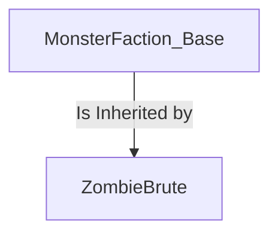
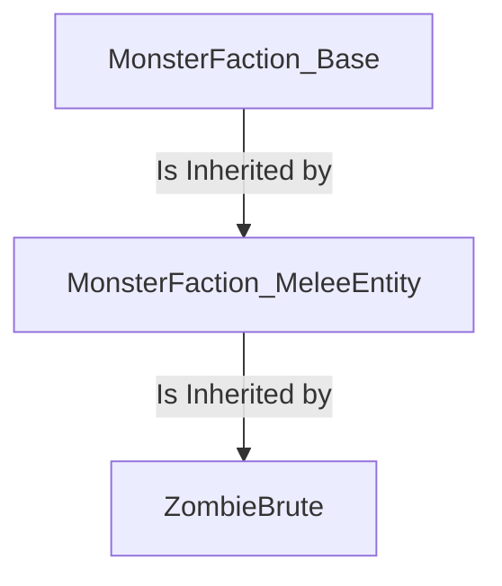
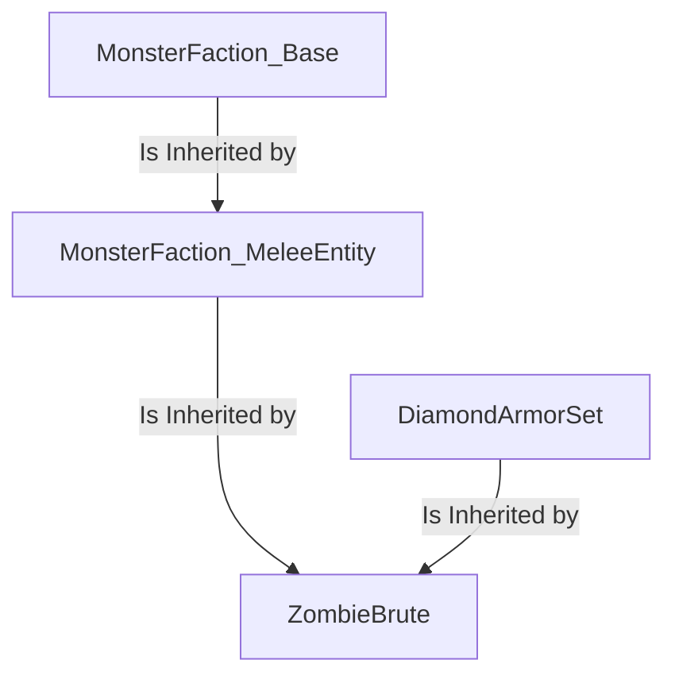

模板 are a functionality that 允许 a 生物 to "继承" the characteristics of one or more 其他 生物.

若you are 已经 familiar with Object Oriented Programming，you将willthen 可能 find the following quite 类似 the c一旦pt of Inheritance。

But regardless, 模板 may 仍然 be found to be quite complicated to understand at first. As such, we 将 adding more nuanche to the c一旦pt as we go on explaining it, starting 从 very basics and gettings to the more complex use cases.

[[_TOC_]]

## 介绍
As 已经 stated, 模板 允许 a 生物 to 继承 the characteristics of 另一个. But what does this even mean?

To explain it in simpler terms, we will present, as an 示例, a 生物:
```yaml
ZombieBrute:
  Type: ZOMBIE
  Display: "&2Zombie Brute &7[Lv. <caster.level>]&r"
  Health: 30
  Damage: 5
  Faction: Monster
  Equipment:
  - Iron_Helmet HEAD
  - Iron_Chestplate CHEST
  - Iron_Leggings LEGS
  - Iron_Boots FEET
  - Shield OFFHAND
  Drops:
  - exp 10-15 1
  - rotten_flesh 1-2 1
  - ZombieBrute_Hearth 1 0.01
  Options:
    AlwaysShowName: true
    PreventOtherDrops: true
    PreventRandomEquipment: true
    PreventSunburn: true
    PreventItemPickup: true
    PreventJockeyMounts: true
    PreventTransformation: true
  AITargetSelectors:
  - clear
  - attacker
  - players
  AIGoalSelectors:
  - clear
  - meleeattack
  - randomstroll
  DamageModifiers:
  - PROJECTILE 1.15
  - ENTITY_ATTACK 0.75
  KillMessages:
  - '<target.name> was reduced to paste by a <caster.name>'
  - 'Despite his best efforts, <target.name> could not prevail against a <caster.name>'
  - '<target.name> was killed by a <caster.name>'
  Skills:
  - skill{s=SelectRandomWeapon} @self ~onSpawn
  - skill{s=ZombieBrute_Bash} @target ~onTimer:60 0.4 ?targetwithin{d=10}
  - skill{s=CallZombies} @EIR ~onTimer:180 0.6
```
That, 当 not complex to make, 肯定 has quite a number of elements 关联 it, 尚未 he? He got a 阵营, some 掉落, some 选项...

Now, what if we wanted to create 另一个 生物 that shares some (if not most!) of the characteristics this 生物 has? We would normally need to copy-paste what we want from one 生物 to 另一个, and 当 that works on the short term, what if we want to later *修改* those characteristics? We would need to track down every instance of them being present on some 生物 and then change those, one by one. That has no scalability whatsoever!

But here, 模板 comes to the rescue: remember what we said originally? They 允许 to 继承 characteristics across 生物, and so, we would need to 仅 make one 生物 that has all of those common characteristics, and if we want to change some of them at a later date, 而不是 going 生物-by-生物, we could 仅 修改 that one 生物 and see the change being 自动 applied to any 生物 that uses it as a 模板!

And that brings us to our first, real 示例 of using 模板.

## Single 模板
Let say that we want to make a group of 生物 share the 阵营, the 选项, the Ai, some of the 技能 and some 其他 element from ZombieBrute. First, we put those elements into a 生物
```yaml
MonsterFaction_Base:
  Type: ZOMBIE
  Faction: Monster
  Drops:
  - exp 10-15 1
  Options:
    AlwaysShowName: true
    PreventOtherDrops: true
    PreventRandomEquipment: true
    PreventSunburn: true
    PreventItemPickup: true
    PreventJockeyMounts: true
    PreventTransformation: true
  AITargetSelectors:
  - clear
  - attacker
  - players
  AIGoalSelectors:
  - clear
  - meleeattack
  - randomstroll
  DamageModifiers:
  - PROJECTILE 0.75
  - ENTITY_ATTACK 0.75
  KillMessages:
  - '<target.name> was killed by a <caster.name>'
  Skills:
  - skill{s=SelectRandomWeapon} @self ~onSpawn
```
And 一旦 we do that, 让我们 make the (now slimmer) ZombieBrute 继承 those
```yaml
ZombieBrute:
  Template: MonsterFaction_Base
  Display: "&2Zombie Brute &7[Lv. <caster.level>]&r"
  Health: 30
  Damage: 5
  Equipment:
  - Iron_Helmet HEAD
  - Iron_Chestplate CHEST
  - Iron_Leggings LEGS
  - Iron_Boots FEET
  - Shield OFFHAND
  Drops:
  - rotten_flesh 1-2 1
  - ZombieBrute_Hearth 1 0.01
  DamageModifiers:
  - PROJECTILE 1.15
  KillMessages:
  - '<target.name> was reduced to paste by a <caster.name>'
  - 'Despite his best efforts, <target.name> could not prevail against a <caster.name>'
  Skills:
  - skill{s=ZombieBrute_Bash} @target ~onTimer:60 0.4 ?targetwithin{d=10}
  - skill{s=CallZombies} @EIR ~onTimer:180 0.6
```
And there! With 仅 a simple line, `Template: MonsterFaction_Base`, is now being Inherited by `ZombieBrute`, with any elements contained in `MonsterFaction_Base` now being 自动 inherited by `ZombieBrute`



But what about elements 即 present on 两者都 the 生物 and its 模板?

### Shared Elements
When 两者都 the 生物 and its 模板 share some elements, one of the following three things happens:
  * The element of the 模板 is overridden by the one in the 生物. (**Overridden**)
    * 示例: 两者都 `MonsterFaction_Base` and `ZombieBrute` have a `PROJECTILE` DamageModifier, so the one in `ZombieBrute` 覆盖 the one in the 模板, and is the one 即 ultimately applied
  * The element of the 模板 is added alongside the one of the 生物. (**Partially Overridden**)
    * 示例: Since the 生物 has no `Faction` element, 它将 继承 the one in the 模板, ultimately being considered as part of the `Monsters` 阵营
    * 示例: 两者都 `MonsterFaction_Base` and `ZombieBrute` have a DamageModifiers element, 与 模板 having `PROJECTILE` and `ENTITY_ATTACK`, 当 the 生物 has 仅 `PROJECTILE`. Since no `ENTITY_ATTACK` DamageModifier is specified in the 生物, the 模板 gets inherited, so in the end the `ZombieBrute` 生物 will take 75% of the 伤害 it would normally take 从 `ENTITY_ATTACK` 伤害 source, despite not having that DamageModifier 自身
  * The elements of the 生物 and of the 模板 are applied 同时, if the elements are part of a 列表. (**Merged**)
    * 示例: `Skills` and `KillMessages` are 两者都 一系列 技能 and messagges 分别, so 您可以 添加 them to 两者都 the 模板 and the 生物 and expect to see all of them to be present on the 生物
    * `AIGoalSelectors` and `AITargetSelectors` are, 也, considered a 列表, so by adding more of them on the 生物, more Selectors are being added at the end of the 列表, 本质上 becoming 其他 Selectors 但具有 less importance than the ones in the 模板, 自从 Selectors 即 placed lower on the 列表 are followed 仅 the one ones 在...上方m 不能 be.
      * To clear the Selectors of the 模板, 仅 use the `clear` Selector

To make this more understandable, the following is 一系列 all of the elements a 模板 may have and how the 生物 will treat them if the 生物 has them 也

| **Element** *(in the 模板)* | **How 它是 inherited** *(if the 生物 has it 也)* |
||---------------------------------------|----------------------------------------------------------------|
| 类型 | Overridden |
| 显示 | Overridden |
| 血量 | Overridden |
| 伤害 | Overridden |
| Armor | Overridden |
| Boss血条 | Overridden |
| 阵营 | Overridden |
| 坐骑 | Overridden |
| Options  | 选项 | Partially Overridden (仅 the shared 选项 are overridden) |
| Modules | Partially Overridden (仅 the shared modules are overridden) |
| AIGoalSelectors | Merged* |
| AITargetSelectors | Merged* |
| 掉落 | Merged |
| DamageModifiers | Partially Overridden (仅 the shared modifiers are overridden)|
| 装备 | Partially Overridden (仅 装备 与 same 栏位 is overridden)|
| KillMessages | Merged |
| LevelModifiers | Partially Overridden (仅 the shared modifiers are overridden)|
| 伪装 | Overridden |
| 技能 | Merged |
| Trades | Partially Overridden (仅 trades 与 same number are overridden)|


\* A special 注意 必须为 made regarding the 行为 of the AIGoalsSelector and the AITargetSelectors elements, as 仅 stating that 它们是 "merged" is a bit reductive. The selector of the 生物 are, in fact, added to the end of the 模板. So, 例如, if the 模板 has a `clear`,`meleeattack` AIGoals and the 生物 has a `randomstroll` one, the final 生物 will effectively have `clear`,`meleeattack`,`randomstroll` as its AIGoals.
若one wishes to reset the Selectors 从 模板，one将can也 use the [`排除`](#排除-elements) element or use the `clear` Selector, as that will "delete" every Selector that came 之前 it。

### Excluding Elements
It is possible to stop a 生物 from inheriting unwanted elements from its 模板 using the following syntax
```yaml
  Exclude:
  - Element1
  - Element2
  - {...}
```

So, 例如, if we wanted a 生物 to not 继承 the 装备, the AITargetSelectors and the 技能, we would be using

```yaml
ExampleMob:
  Template: MobTemplate
  Exclude:
  - Equipment
  - AITargetSelectors
  - Skills
```
And the 生物 will now not 继承 the specified elements.

## Chained 模板
But why should we stop at 仅 one 模板? After all, 模板 can have a 模板, 也! Let revisit out 示例 from earlier, but this time splitting it up a little bit more

```yaml
MonsterFaction_Base:
  Type: ZOMBIE
  Faction: Monster
  Drops:
  - exp 10-15 1
  Options:
    AlwaysShowName: true
    PreventOtherDrops: true
    PreventRandomEquipment: true
    PreventSunburn: true
    PreventItemPickup: true
    PreventJockeyMounts: true
    PreventTransformation: true
  DamageModifiers:
  - PROJECTILE 0.75
  - ENTITY_ATTACK 0.75
  KillMessages:
  - '<target.name> was killed by a <caster.name>'
```

```yaml
MonsterFaction_MeleeEntity:
  Template: MonsterFaction_Base
  Equipment:
  - Iron_Helmet HEAD
  - Iron_Chestplate CHEST
  - Iron_Leggings LEGS
  - Iron_Boots FEET
  - Shield OFFHAND
  AITargetSelectors:
  - clear
  - attacker
  - players
  AIGoalSelectors:
  - clear
  - meleeattack
  - randomstroll
  Skills:
  - skill{s=SelectRandomWeapon} @self ~onSpawn

```

```yaml
ZombieBrute:
  Template: MonsterFaction_MeleeEntity
  Display: "&2Zombie Brute &7[Lv. <caster.level>]&r"
  Health: 30
  Damage: 5
  Drops:
  - rotten_flesh 1-2 1
  - ZombieBrute_Hearth 1 0.01
  DamageModifiers:
  - PROJECTILE 1.15
  KillMessages:
  - '<target.name> was reduced to paste by a <caster.name>'
  - 'Despite his best efforts, <target.name> could not prevail against a <caster.name>'
  Skills:
  - skill{s=ZombieBrute_Bash} @target ~onTimer:60 0.4 ?targetwithin{d=10}
  - skill{s=CallZombies} @EIR ~onTimer:180 0.6
```

This way, we have created a new 生物, `MonsterFaction_MeleeEntity`, 即 using `MonsterFaction_Base` as a 模板.

And with `ZombieBrute` using `MonsterFaction_MeleeEntity` as a 模板, it 不 继承 the 仅 elements of `MonsterFaction_MeleeEntity`, but 也 those that `MonsterFaction_MeleeEntity` 自身 inherited 最多 that point.



## Multi 模板
Up 直到 now we have shown how to use a single 模板 inside of a 生物, but a 生物 can use 多于 one at 同时.

By 仅仅 using 一系列 模板 as the 模板 argument, we can make the 生物 继承 one 模板 之后 另一个 **从 leftmost on the 列表 to the rightmost**. Simply said, by making 一系列 模板, 它是 like we are chaining multiple 模板 一起, starting 从 leftmost one and ending 与 rightmost one.

But 让我们 see an 示例 to make things clear:
```yaml
DiamondArmorSet:
  Type: ZOMBIE
  Equip:
  - Diamond_Helmet HEAD
  - Diamond_Chestplate CHEST
  - Diamond_Leggings LEGS
  - Diamond_Boots FEET
```
This 生物 不hing in particular by 自身, its 仅 characteristic being the diamond set of armor 它有 equipped. But if we use it like so:

```yaml
ZombieBrute:
  Template: MonsterFaction_MeleeEntity, DiamondArmorSet
  Display: "&2Zombie Brute &7[Lv. <caster.level>]&r"
  Health: 30
  Damage: 5
  Drops:
  - rotten_flesh 1-2 1
  - ZombieBrute_Hearth 1 0.01
  DamageModifiers:
  - PROJECTILE 1.15
  KillMessages:
  - '<target.name> was reduced to paste by a <caster.name>'
  - 'Despite his best efforts, <target.name> could not prevail against a <caster.name>'
  Skills:
  - skill{s=ZombieBrute_Bash} @target ~onTimer:60 0.4 ?targetwithin{d=10}
  - skill{s=CallZombies} @EIR ~onTimer:180 0.6
```

Then our dear `ZombieBrute` now will 生成 with a shiny new set of diamond armor, 自从 the `DiamondArmorSet` 模板 is overriding some of the equipments present in `MonsterFaction_MeleeEntity`



##

## 物品 模板
[物品](/物品/物品#模板) can use Templating like 生物 当 referencing 其他 物品!
```yaml
MyItem:
  Template: MyOtherItem
```
```yaml
MyOtherItem:
  Template: YetAnotherItem, AndAnotherOne
```