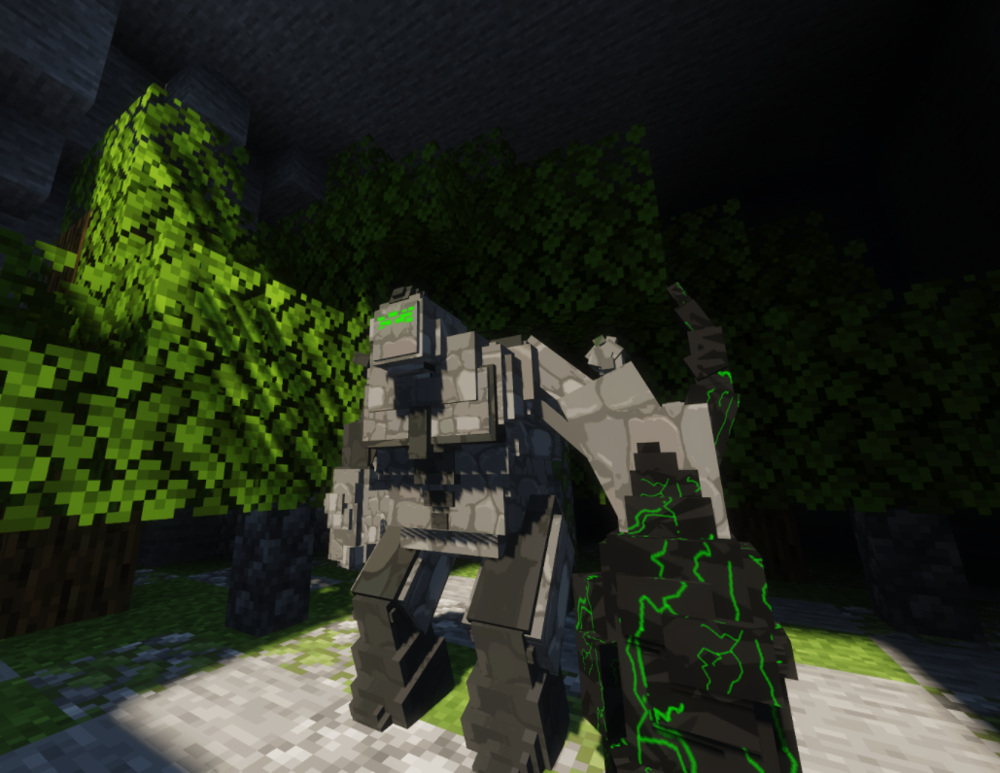
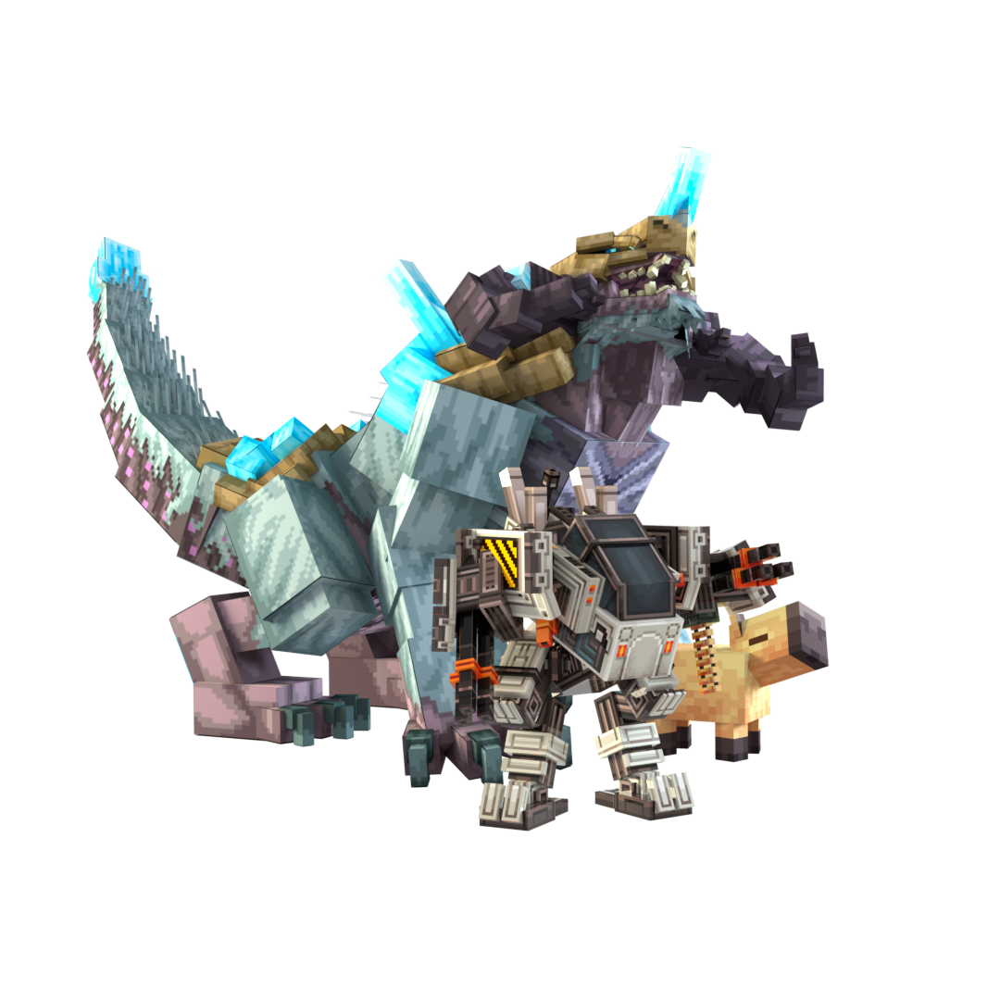

### ModelEngine 自定义模型

**ModelEngine 依赖于插件 [ModelEngine](https://www.spigotmc.org/resources/conxeptworks-model-engine%E2%80%94ultimate-entity-model-manager-1-14-1-16-5.79477/)，并且需要使用自定义资源包。[ModelEngine 最新文档可在此处找到](https://git.lumine.io/mythiccraft/model-engine-4/-/wikis/home)。你也可以加入 Mythic 官方的[支持 Discord](https://discord.com/invite/K3tqXfT) 寻求帮助。**

*ModelEngine 提供几个特殊模型的免费试用，所以你可以在购买前先试用，而且他们的 Wiki 上还有一个免费测试模型。你需要自己制作或购买模型。*

### 技术内容介绍完毕... 为什么使用 ModelEngine？

ModelEngine 让任何使用 BlockBench 的人都能快速轻松地创建自定义模型和碰撞箱，类似于你在模组包中看到的效果——一切都在原版客户端中完成，使用盔甲架和资源包。

一般建议使用 `PreventOtherDrops` 和 `silent` 生物选项，以避免 ModelEngine 怪物产生奇怪的掉落物或声音。

<!--  -->


### 机制

ModelEngine 通过几个机制来应用到生物上。

要将 "kindletronjr" 模型应用到生物上，在生物的 skills 部分使用：
`- model{mid=kindletronjr;n=false} @self ~onSpawn`
要播放你制作好的攻击动画，在生物的 skills 部分使用：
`- state{mid=kindletronjr;s=attack;} @self ~onAttack`

完整属性和机制列表请访问 ModelEngine Wiki：
https://git.mythiccraft.io/mythiccraft/model-engine-4/-/wikis/home

### 示例：

```yaml
KindletronJR:
  Type: SILVERFISH
  Health: 20
  Damage: 0
  Skills:
  - model{mid=kindletronjr} @self ~onSpawn
  - skill{s=KindletronJRInit;sync=true} @self ~onAttack
  Options:
    Silent: true
    MovementSpeed: 0.1
    MaxCombatDistance: 25
    PreventOtherDrops: true
    PreventBlockInfection: true
```

或者，也可以使用以下方式设置模型：
```yaml
KindletronJR:
  Type: SILVERFISH
  Health: 20
  Damage: 0
  Model:
    Id: kindletronjr
    ViewRadius: 64
    Drive: false
    DamageTint: true
  Skills:
  - skill{s=KindletronJRInit;sync=true} @self ~onAttack
  Options:
    Silent: true
    MovementSpeed: 0.1
    MaxCombatDistance: 25
    PreventOtherDrops: true
    PreventBlockInfection: true
```
