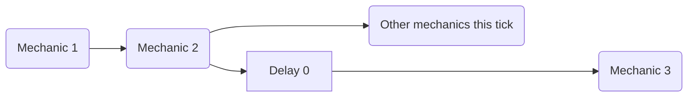
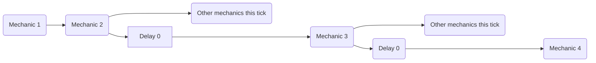

TThe [delay] 机制可以usedto 应用 a delay not 仅 *between* ticks, but 也 inside of the same tick via a `delay 0` 机制。

# DISCLAIMER
ThThis 不是 an intended 机制. It 仅 a side-效果 that consistently works 因为 of how the 插件 scheduler operates

While i have extensively tested this 行为 之后 discovering it 之前 documenting it, 它是 仍然 very possible that new applications or game-breaking 行为 are 仍然 present. If you have any information useful to further expand this page and, by proxy, the knowledge available to every 其他 MythicMobs user, let me know: [Lxlp Discord Profile](https://discord.com/users/353257382811533322)

## Single Delay

You 必须 imagine each 机制 as 一系列 instructions 即 executed orderly. In this scenario, using a `delay 0` 机制 允许 "schedule" the subsequent 机制 to be executed *之后* every 其他 non delayed 机制 that tick.



### 示例
```yaml
ExampleMechanic:
  Skills:
  - skill{s=Skill1} @self
  - skill{s=Skill2} @self

Skill1:
  Skills:
  - delay 0
  - message{m="<skill.var.test>"}

Skill2:
  Skills:
  - setvariable{var=test;val=1}
```
> Executing the ExampleMechanic will output
>> - `UNDEFINED` if no delay 0 is used
>> - `1` 否则

## Multiple Delays
This 行为 works with multiple delays 也: each time a new `delay 0` is executed, the subsequent 机制 are pushed a the back of the execution line *再次*




### 示例
```yaml
ExampleMechanic:
  Skills:
  - skill{s=SkillMessage} @self
  - skill{s=Skill1} @self
  - skill{s=Skill2} @self

Skill1:
  Skills:
  - delay 0
  - setvariable{var=test;val=2}

Skill2:
  Skills:
  - setvariable{var=test;val=1}

SkillMessage:
  Skills:
  - delay 0
  - delay 0
  - message{m="<skill.var.test>"}
```
> Executing the ExampleMechanic will output
>> - `UNDEFINED` if no delay 0 is used inside of SkillMessage
>> - `1` if 仅 one delay 0 is used inside of SkillMessage
>> - `2` if all delays are used inside of SkillMessage


## 示例
```yaml
ExampleSkill:
  Cooldown: 0
  OnCooldownSkill: ExampleSkill-DisplayCooldown
  Skills:
  - delay 0
  - setSkillCooldown{s=ExampleSkill;seconds=<skill.cooldown>/20} @self
```
> > In this 示例 if no `delay 0` is set then the `setSkillCooldown` would have run regardless, but the new 冷却 值 would 已被 overridden by ExampleSkill, as the 冷却 对于 元技能 is set *之后* any non delayed 机制 in the 元技能 are executed.
> Using a `delay 0` 允许 to 应用 a delay to the setSkillCooldown 机制, allowing it to set the 冷却 *之后* ExampleSkill 已被 set *没有* needing to wait for an extra tick, which could have allowed for possible edge cases to cause a bug


```yaml
ExampleSkill:
  Skills:
  - delay 0 ?variableisset{var=caster.example}
  - message{m=<caster.var.example>} @self
```
> In this 示例 a delay 0 用于 give a 变量 enough time to be set 之前 its 值 is fetched. This has the drawback of making it impossible to 精确地 know 之前hand how many intratick delays 将 applied, but if, on the contrary, 它是 not 已经 know how many intraticks 将 needed to set the 变量 this can be a valuable tradeoff


<!-- LINKS -->
[delay]: /技能/机制/delay