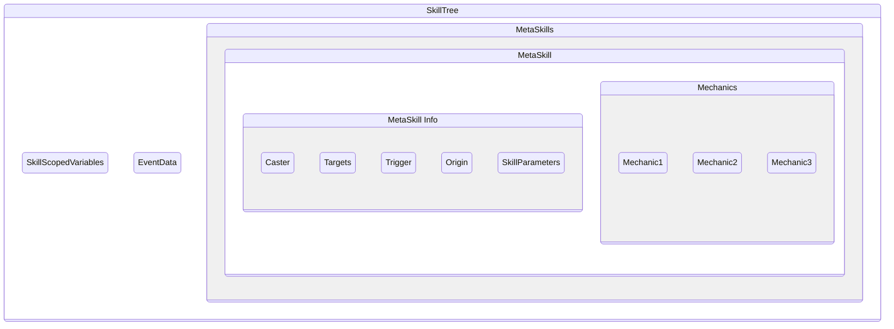

SkSkillTrees are an implicit feature of Mythic and, 当 they 不能 be directly invoked like [元技能] or 其他 features, play 仅 as important a role.

SkillTrees are **created each time a 技能 is fired by a 触发器**, and 它是 the place where 技能 scoped [变量] are stored and inside which [元技能] exist

[[_TOC_]]

# SkillTree 结构

## 技能 Scoped 变量

Since they exist in the skilltree 自身, 技能-scoped 变量 can be accessed and modified by any [元技能] in the skilltree 从 moment 它们是 created, 无论 which [元技能] created them

## 事件 Data
The skilltree 总是 knows which 事件 triggered it, and 允许 the [cancelevent](/技能/技能/cancelevent) 技能 to be used in any of the 元技能 it calls 为了 cancel it, 只要 this occurs in a synched manner

## 元技能
Each [元技能] 即 being called in the SkillTree has its own set of data regarding different elements.
NoNormally, the 值 of those elements is copied over 从 calling 元技能 除非 overridden.
Those elements are:
### `施法者`
The 实体 casting the 元技能.
  - Can be changed via the use of the [sudoskill] 技能
### `目标`
It is the [Inherited 目标](/技能/元技能#inheritance) of the 元技能

### `触发器`
Is first set as the 实体 that triggered the SkillTree initially, and one can fetch this 实体 via the [@触发器] 目标选择器 or 其他 similar 目标选择器. Depending on the [~触发器] used, a [@触发器] 可能不 exist.
  -- The `Trigger` can be changed via the use of the [sudoskill] 技能 `casterastrigger` 属性, which will make the called 元技能 have, as the `Trigger`, the `Caster` of the original 元技能
### `原点`
It the [@原点] of the 元技能. By 默认, 它是 the position of the `Caster`.
  -可以setvia the `origin` [universal 属性]。
  - It is 自动 set in 技能 例如 [弹射物](/技能/技能/弹射物)
### `技能 参数`
TThe [技能 参数] of the 元技能. Please 注意 that, contrary to [技能 Scoped 变量](#技能-scoped-变量), they 不要 exist on the skilltree 自身.

<!-- LINKS -->
[元技能]: /技能/元技能
[元技能]: /技能/元技能
[变量]: /技能/变量
[sudoskill]: /技能/技能/SudoSkill
[~触发器]: /技能/触发器
[@触发器]: /技能/目标选择器/触发器
[@原点]: /技能/目标选择器/原点
[universal 属性]: /技能/技能#universal-属性
[技能 参数]: /技能/元技能#技能-参数-premium-feature