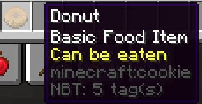

甜甜圈
--------------
* 一个使用资源包、[Mythic Crucible](https://git.lumine.io/mythiccraft/mythiccrucible) 和 [CustomModelData](https://mcmodels.net/how-to-tutorials/resource-pack-tutorials/what-is-custommodeldata-2/) 使其看起来像甜甜圈的曲奇示例物品。食用时，提供短暂的饱和药水效果并少量恢复饱腹感。

关于"eatmeal"技能的使用方式，请参见[此处](https://git.lumine.io/mythiccraft/MythicMobs/-/wikis/Consumable-Skills#eat-food-skill)。

```yaml
donut:
  Id: COOKIE
  Display: '甜甜圈'
  Model: 1
  Lore:
  - '&f基础食物物品'
  - '&e可食用'
  Skills:
  - skill{s=eatmeal} ~onConsume
```


